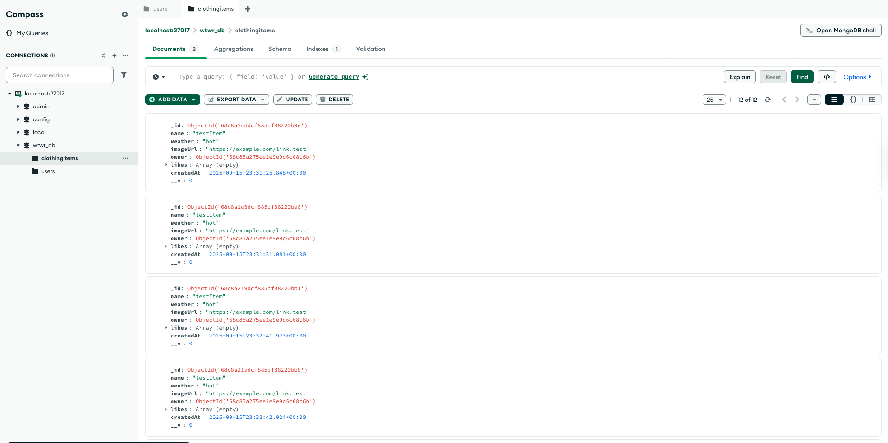
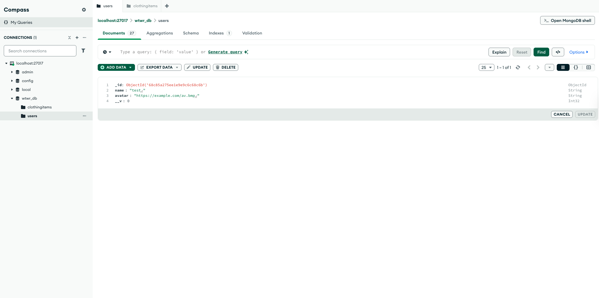
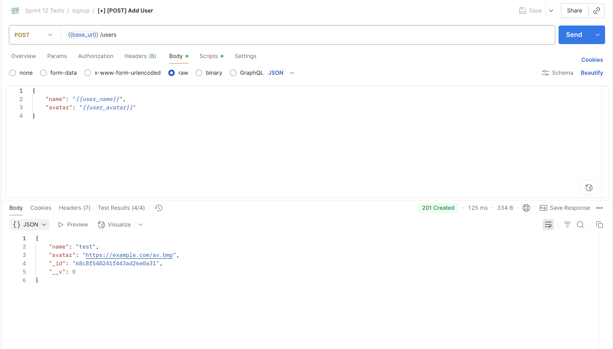

# WTWR (What to Wear?) — Backend

This project is the backend service for the **WTWR (What to Wear?)** application.  
It provides a RESTful API built with **Node.js**, **Express**, and **MongoDB**, enabling users to manage clothing items and interact with their wardrobe data.

---

## Features

### User Management

- Create a user with `name` and `avatar`.
- Fetch all users or a single user by ID.
- Error handling for invalid IDs or non-existent users.

### Clothing Items

- **GET /items** — fetch all clothing items.
- **POST /items** — create a new clothing item (`name`, `weather`, `imageUrl`, `owner`).
- **DELETE /items/:itemId** — delete a clothing item by ID.
- **PUT /items/:itemId/likes** — like a clothing item.
- **DELETE /items/:itemId/likes** — dislike a clothing item.

### Error Handling

- **400** — invalid data (validation errors, invalid ID format).
- **404** — resource not found (invalid route, missing user/item).
- **500** — internal server error (default).

---

## Tech Stack

- [Node.js](https://nodejs.org/) — JavaScript runtime
- [Express.js](https://expressjs.com/) — web framework
- [MongoDB](https://www.mongodb.com/) + [Mongoose](https://mongoosejs.com/) — database & ODM
- [ESLint](https://eslint.org/) + Airbnb config — code quality
- [Validator.js](https://github.com/validatorjs/validator.js) — input validation

---

## Installation & Setup

1.  **Clone the repo**
    ```bash
    git clone https://github.com/prakruthin/se_project_express.git
    cd se_project_express
    ```
2.  **Install dependencies**
    ```bash
    npm install
    ```
3.  **Run MongoDB locally**
    Make sure MongoDB is running on:

    ```bash
    mongodb://127.0.0.1:27017/wtwr_db
    ```

4.  **Start the server**

    ```bash
    npm run start
    ```

    Or, for development with hot-reload:

    ```
    npm run dev
    ```

## API Endpoints

### Users

---

GET /users - Get all users

GET /users/:id - Get user by ID

POST /users - Create a new user

### Clothing Items

---

GET /items - Get all items

POST /items - Create a new item

DELETE /items/:itemId - Delete an item

PUT /items/:itemId/likes - Like an item

DELETE /items/:itemId/likes - Dislike an item

## Testing with Postman

You can test the routes using Postman:

Base URL: http://localhost:3001

Example: GET http://localhost:3001/items

## Screenshots

### ClothingItems





## Future Improvements

- User authentication (JWT-based).

- Role-based permissions.

- Cloud storage for images.

- CI/CD pipeline with GitHub Actions.
